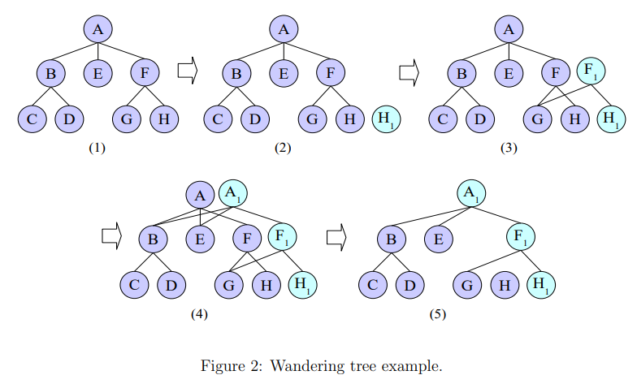

# F2FS Overview

F2FS *`Flash Friendly File System`* 는 FTL *`Flash Translation layer`* Device를 위해 특별히 설계된 로그 구조 파일 시스템 *`(Log-structured File System, LFS)`* 입니다.  
기존의 로그 구조 파일 시스템과 비교할 때 F2FS는 *`Wandering Tree`* 및 남아있는 용량이 적은 상황에서 *`Garbage Collection or Cleaning`* 으로 인한 성능 하락을 개선하였습니다.

### Wandering Tree Problem
LFS 구조에서는 Log의 마지막에 file data를 update/write 하게 됩니다. 위치가 변경되면서 해당 log의 direct pointer block이 update되고, direct pointer block을 가리키는 indirect pointer block도 update됩니다.
In this manner,
the upper index structures such as inode, inode map, and checkpoint block are
also updated recursively. This problem is called as wandering tree problem [1],
and in order to enhance the performance, it should eliminate or relax the update
propagation as much as possible.

[1] Bityutskiy, A. 2005. JFFS3 design issues. http://www.linux-mtd.infradead.org/

*[사진 출처 : (http://www.linux-mtd.infradead.org/tech/JFFS3design.pdf)](http://www.linux-mtd.infradead.org/tech/JFFS3design.pdf)*