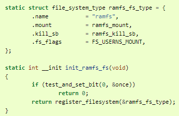

# Filesystem register

### 목적
`register_filesystem()` 함수를 통해 이름, 플래그, 수퍼블록 읽기 작업을 구현하는 함수 및 현재 모듈을 식별하는 구조에 대한 참조를 사용하여 struct file_system_type 유형의 구조를 초기화합니다.
- 모듈을 언로드할 때 unregister_filesystem() 함수를 호출하여 파일 시스템을 등록 해제해야 합니다.

